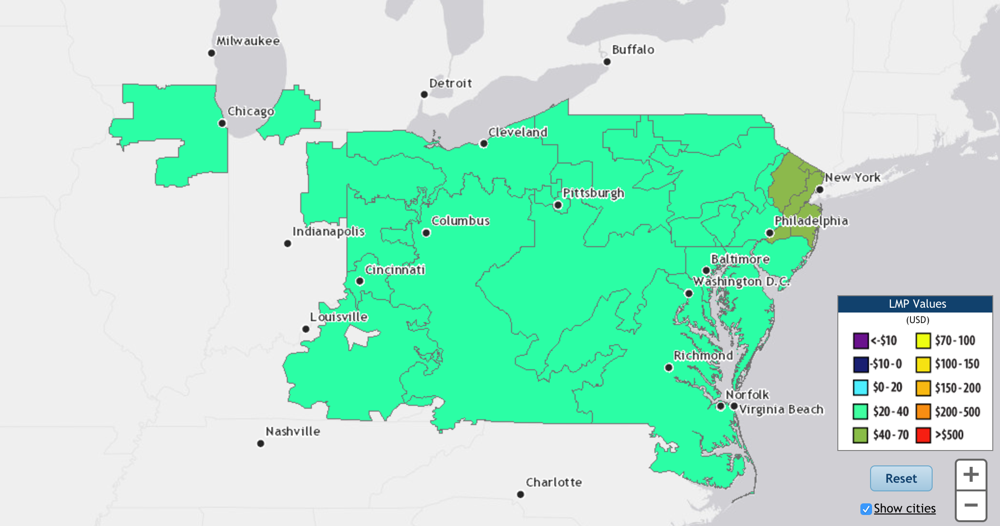

#Background

Let's have some fun with the spot electricity market in Chicago.

Locational Marginal Price (LMP) is the wholesale price of electricity at a given point on the grid *right now*.  While forward contracts (agreements to purchase electric at some later delivery date) are often very predictable, LMP is relatively volatile and can swing substantially depending on a lot of factors - failures in the transmission network, failures at a power plant, or bad planning, but usually just spikes in demand caused by the weather.  

Read more about them here: https://www.pjm.com/~/media/about-pjm/newsroom/fact-sheets/locational-marginal-pricing-fact-sheet.ashx

**PJM** (loosely Pennsylvania, New Jersey, Maryland) is the Regional Transmission Organization (RTO) that coordinates power generation and transmission across much of the Mid-Atlantic USA, and also Chicago (the rest of the midwest is handled by a similar organization, **MISO**).  PJM splits the area under their control into Load Zones, which contain Nodes, which all have instantaneous LMP's associated with them.


*A map of zonal LMP for PJM*

Load forecasting is fairly common, but LMP spikes still occur.  Let's throw our hat into the LMP spike prediction ring, for a single point.

The zone we care about is called **COMED**, short for Commonwealth Edison, and the node we're going to look at is number 
33092313, "Chicago Hub."  There are hundreds of nodes in Chicago, but this one should be roughly representative.

In part 1 of this exercise, we'll detect outliers by fitting a model to our data and seeing what points stick out.  In part 2, we'll incorporate some weather data and see if we can't forecast the occurrence of outliers.

#Data

We'll start by pulling Chicago Hub LMP data for the last three years.  PJM makes this relatively easy with their Data Miner tool (http://www.pjm.com/markets-and-operations/etools/data-miner.aspx).

```{r setup, include = FALSE}

library(dplyr)
library(lubridate)
library(reshape)
library(tseries)
library(forecast)
library(ggplot2)
```

```{r warning=FALSE}
lmp <- data.frame(read.csv('CE-LM-814-817.csv'))
#sapply(lmp,class)
head(lmp,1)
```

Not bad.  For whatever reason this data is pivoted to have all the hours on one row, and this H2DST column (looks to be that extra hour you get on the clock when daylight savings ends) is tricky.  There are only three instances where it's not NA, and they look to be pretty close to H3, so we're going to just ignore them here.  There are three corresponding NA values in H3 for the start of DST, let's just patch those up with the same LMP as the next 4 AM.

Let's quickly clean up the data to the columns we care about, and unpivot ("melt") it.

```{r warning=FALSE}

lmp <- select(lmp,PUBLISHDATE,H1,H2,H3,H4,H5,H6,H7,H8,H9,H10,H11,H12,H13,H14,H15,H16,H17,H18,H19,H20,H21,H22,H23,H24)

lmp <- lmp %>% mutate(H3 = replace(H3,PUBLISHDATE == '03-08-2015',10.41))
lmp <- lmp %>% mutate(H3 = replace(H3,PUBLISHDATE == '03-13-2016',27.8))
lmp <- lmp %>% mutate(H3 = replace(H3,PUBLISHDATE == '03-12-2017',25.17))

lmp <- melt(lmp,id = 'PUBLISHDATE')

fixLMPDate <- function(date,hour)
{
  hour <- as.numeric(sub(x = as.character(hour),pattern = 'H',replacement = '')) - 1
  mdy_h(paste(as.character(date),hour))
}

lmp$time <- fixLMPDate(lmp$PUBLISHDATE,lmp$variable)

lmp <- select(lmp,time,value)
#lmp <- filter(lmp,time > '2015-01-01',time < '2017-01-01')

ggplot(filter(lmp,time > '2015-01-01',time < '2016-01-01'), aes(x=time,y=value)) + geom_line() + ggtitle("CE LMP, 2015")

ggplot(filter(lmp,time > '2015-01-01',time < '2015-02-01'), aes(x=time,y=value)) + geom_line() + ggtitle("CE LMP, January 2015")

ggplot(filter(lmp,time > '2015-01-12',time < '2015-01-14'), aes(x=time,y=value)) + geom_line() + ggtitle("CE LMP, One Week in January 2015")
```

Alright!  That's some good looking LMP.  Something that you might notice is that around January 20, the price goes negative.  This isn't a bug - occasionally, the cost of shutting down supply to match abnormally low demand may be so high that it's actually preferable to pay someone to absorb your electricity than to turn off your power plant.  You rarely see this in markets with a lot of wind, hydroelectric, nuclear, or other hard-to-stop generators, and only then not for very long.

#Method

So what I'd like to do with this data is **flag and predict outliers**.  As you can probably see from the time series, there are some really high spikes in LMP compared to the background price of about $25-$40. But, there are also some smaller spikes that look out of place - in addition to there being noise everywhere.

Outlier detection with time-series data is rarely as simple as throwing out everything above or below some threshold, especially when the data is noisy and seasonal - normal data from one time frame could be wildly unexpected in another.  A better approach would be to fit a model to our data, create a time-dependent envelope of reasonable values, and then flag anything outside that envelope as an outlier.

Once we have our outliers, we'll bring in some extrinsic data (like the weather), couple it to our LMP data, and make a model to associate extremes in the two and forecast future outliers.

#Detecting Outliers with Moving Averages

A really simple way of smoothing a time series is with a moving average.  Depending on the size of your window, you can get a feel for the appropriate distribution of values for a given time.

```{r warning=FALSE}
#look at moving averages

lmp$three.hourly <- ma(lmp$value,order = 3)
lmp$half.daily <- ma(lmp$value,order = 12)
lmp$daily <- ma(lmp$value,order = 24)
lmp$three.daily <- ma(lmp$value,order = 72)
lmp$weekly <- ma(lmp$value,order = 24*7)

lmp$three.hourly.r <- abs(lmp$three.hourly - lmp$value)
lmp$half.daily.r <- abs(lmp$half.daily - lmp$value)
lmp$daily.r <- abs(lmp$daily - lmp$value)
lmp$three.daily.r <- abs(lmp$three.daily - lmp$value)
lmp$weekly.r <- abs(lmp$weekly - lmp$value)

lmp.f <- filter(lmp,time > '2015-03-14',time < '2015-03-28')

ggplot() + ggtitle("CE LMP vs Smooth") +
  geom_line(data = lmp.f, aes(x=time,y=value), alpha = 0.8) +
  geom_line(data = lmp.f, aes(x=time,y=three.hourly), color = 'gray', alpha = 0.6) +
  geom_line(data = lmp.f, aes(x=time,y=half.daily), color = 'red', alpha = 0.6) +
  geom_line(data = lmp.f, aes(x=time,y=daily), color = 'blue', alpha = 0.6) +
  geom_line(data = lmp.f, aes(x=time,y=three.daily), color = 'green', alpha = 0.6) 
  geom_line(data = lmp.f, aes(x=time,y=weekly), color = 'purple', alpha = 0.6) 

ggplot() + ggtitle("CE LMP vs Smooth Residuals") +
  geom_line(data = lmp.f, aes(x=time,y=value), alpha = 0.8) +
  geom_line(data = lmp.f, aes(x=time,y=three.hourly.r), color = 'gray', alpha = 0.6) +
  geom_line(data = lmp.f, aes(x=time,y=half.daily.r), color = 'red', alpha = 0.6) +
  geom_line(data = lmp.f, aes(x=time,y=daily.r), color = 'blue', alpha = 0.6) +
  geom_line(data = lmp.f, aes(x=time,y=three.daily.r), color = 'green', alpha = 0.6) +
  geom_line(data = lmp.f, aes(x=time,y=weekly.r), color = 'purple', alpha = 0.6)
```

Using just the moving averages, you can get a sense we're on the right track - outliers stand out clearly against the smoothed time series.  From the residual plot we get a sense that the three-hourly window might be too tight to accurately spot outliers - there are a few things that look like false positives.

If we just had moving averages, we could say any LMP where the residual vs the daily average value was > $50 was an outlier.  This would spot big spikes, but what about smaller deviations?  If we're ultimately trying to link outlier LMP's to weather, it would be a hard sell to convince someone that a huge spike in LMP was due to a single hour of bad weather - weather doesn't change that fast. 

*(Quick aside: What we might think about though, is that sustained weather conditions might increase the chance of an unexpected failure in Chicago's energy infrastructure, which would create an instantaneous LMP spike.  Number of consecutive mini-outliers might be an interesting feature for a future model.)*

Can we do better than just MA?  Probably.  Let's use an autoregressive model to fit the data more directly, and see how those residuals look.

#Detecting Outliers with an Autoregressive Model

Autoregressive models are a class of methods for using a time series's history to predict future values.  If a series has a clear periodic trend, that periodicity can be exploited.  To make that periodicity more obvious, and to help fit a reasonable model, we're going to smooth the data a little bit - this will have the effect of blending outliers into background data, which will make the model a little worse overall in exchange for making the outliers stick out as residuals.

After eyeballing our experiments with MA, let's try an order 12 smoother.

```{r warning=FALSE}

lmp.c <- select(lmp,time,value)
names(lmp.c) <- c('time','value')

lmp.c$daily <- ma(lmp.c$value,order = 12)

ggplot(lmp.c, aes(x=time,y=daily)) + geom_line() + ggtitle("CE LMP 12-MA")

ggplot(filter(lmp.c,time > '2015-01-01',time < '2015-02-01'), aes(x=time,y=daily)) + geom_line() + ggtitle("CE LMP 12-MA, January 2015")

```

If I had to guess, I would say people in Chicago use electricity differently day vs night, weekday vs weekend, and summer vs winter.

Let's confirm our suspicions that there are periodic patterns in the data by looking in at the autocorrelation and partial autocorrelations, as well as the seasonal decomposition.  We'll also check if the data is stationary.

```{r warning=FALSE}
Acf(lmp.c$daily,main='')
Pacf(lmp.c$daily,main='')

adf.test(na.omit(lmp.c$daily), alternative = "stationary")

lmp.t <- ts(na.omit(lmp.c$daily),frequency=24*362) #hourly observations for a year
decomp <- stl(lmp.t, s.window = 'periodic')
plot(decomp)
```

Looks like the data is stationary with some well-behaved autocorrelations.  We can also see a seasonal component - LMP seems to drift up during the summer, and a little bit less in the peak of winter, but not more than $5 on average in either direction.  There's a trend too - looks like the overall price of energy went up in 2015, by about $10.

An interesting thing to note is that the PACF has a spike at lags 1-12 and also multiples of 12:  this is probably due to a real daily trend, and also a bit of the 12-hour smoothing we applied.

Let's fit an ARIMA model (if we wanted to be cooler, we could fit a model designed for multiple seasonality, like TBATS, but the annual and weekly trends don't seem too large).  Judging from the PACF, we'll make it a (6,1,1), incorporating 6 autoregressive features and one MA feature.  We'll inspect the model vs the smoothed data, vs the real data, and the autocorrelation and distributions of the residual (we're looking for small lags coefficients and normality).

```{r warning=FALSE}
fit = arima(lmp.c$daily, order=c(6,1,1))

summary(fit)

tsdisplay(residuals(fit), lag.max=45, main='(6,1,1) Model Residuals')

fcast <- forecast(fit, h=300)

#plot(fitted(fit),col = 'blue')

lmp.c$fit <- fitted(fit)
lmp.c$resid <- lmp.c$value - lmp.c$fit
lmp.c$m.resid <- lmp.c$daily - lmp.c$fit

lmp.f <- filter(lmp.c,time > '2015-01-14',time < '2015-03-14')

ggplot() + ggtitle("CE LMP 12-MA vs Model") +
  geom_line(data = lmp.f, aes(x=time,y=daily), alpha = 0.8, color = 'black') +
  geom_line(data = lmp.f, aes(x=time,y=fit), alpha = 0.6, color = 'blue')

ggplot() + ggtitle("CE LMP vs Model") +
  geom_line(data = lmp.f, aes(x=time,y=value), alpha = 0.8, color = 'black') +
  geom_line(data = lmp.f, aes(x=time,y=fit), alpha = 0.6, color = 'blue')

ggplot() + ggtitle("CE LMP vs Residuals") +
  geom_line(data = lmp.f, aes(x=time,y=value), alpha = 0.8, color = 'black') +
  geom_line(data = lmp.f, aes(x=time,y=resid), alpha = 0.6, color = 'blue')

qplot(lmp.c$resid)
Pacf(lmp.c$resid,main='')

qplot(lmp.c$m.resid)
Pacf(lmp.c$m.resid,main='')
```

Cool!  Our model fits the smoothed data pretty well (we could take a stab at making a ARIMA(12,1,1) maybe), and the residuals against the real data look like they line up with outliers. 

Let's do what we set out to do, flag the outliers in the series (that is, outliers that don't conform to our autoregressive model of LMP).  

```{r warning=FALSE}

#value and resid

summary(lmp.c$resid)
#IQR(na.omit(lmp.c$resid))

lmp.out <- filter(lmp.c,resid > 27) #magic number is about 3x IQR

lmp.f <- filter(lmp.c,time > '2015-03-14',time < '2015-03-28')
lmp.out.f <- filter(lmp.out,time > '2015-03-14',time < '2015-03-28')

ggplot() + ggtitle("CE LMP with Outliers Highlighted") +
  geom_line(data = lmp.f, aes(x=time,y=value), alpha = 0.8, color = 'black') +
  geom_point(data = lmp.out.f, aes(x=time,y=value), alpha = 0.6, color = 'red')

```

You know what's great?  We could have just used `tsclean`, which does basically the same thing.

```{r warning=FALSE}
lmp.c$clean <- tsclean(lmp.c$value)

lmp.f <- filter(lmp.c,time > '2015-03-14',time < '2015-03-28')

ggplot() + ggtitle("CE LMP vs tsclean") +
  geom_line(data = lmp.f, aes(x=time,y=value), alpha = 0.8, color = 'red') +
  geom_line(data = lmp.f, aes(x=time,y=clean), alpha = 0.8, color = 'black')
```

Oh well.  See you in part 2!